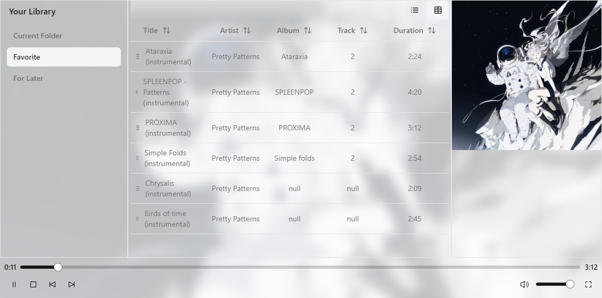

<div align="center">


<h1>Tauri Media Player</h1>


A modern, media player built with Tauri, React, and MPV. Designed with video and music playback in mind.

An experimental project exploring Rust FFI and dynamic library by creating a modern GUI wrapper for MPV. This project explores interfacing with C libraries in Rust while building a practical media player application with a clean, modern interface using Tauri and React.

Currently available for Windows only.

<!-- <video width="100%" controls>
  <source src="demo.mp4" type="video/mp4">
  Your browser does not support the video tag.
</video> -->



</div>

## 🚀 Features

-   🎵 Advanced media playback using MPV
-   📱 Modern UI with shadcn/ui components
-   🎨 Beautiful design with Tailwind CSS
-   📋 Playlist management with drag-and-drop support
-   🎮 Hardware-accelerated video playback
-   📁 Support for various media formats

## 🛠️ Tech Stack

-   **Frontend**: React + TypeScript
-   **UI Components**: shadcn/ui (based on Radix UI)
-   **Styling**: Tailwind CSS
-   **State Management**: Nanostores
-   **Backend**: Tauri (Rust)
-   **Media Engine**: MPV (via FFI)
-   **Database**: SQLite with Drizzle ORM and migrations with Drizzle Kit
-   **Build Tool**: Vite

## 🔧 Prerequisites

-   Windows 10 or later

## 📦 Installation

1. Download the latest release from the [Releases page](https://github.com/yourusername/tauri-media-player/releases)
2. Run the installer
3. Follow the installation wizard

## 💻 Development Setup

If you want to contribute or build from source:

1. Prerequisites:

    - Node.js (v20 or higher)
    - Rust (latest stable)
    - Cargo (Rust package manager)
    - Git

2. Clone and setup:
    ```bash
    git clone https://github.com/yourusername/tauri-media-player.git
    cd tauri-media-player
    pnpm install
    ```

3. Ensure the dynamic library files are in `src-tauri\lib\` (i.e. `src-tauri\lib\mpv\libmpv-2.dll` exists)

4. Start development server:
    ```bash
     pnpm run tauri dev
    ```

5. Build for production:
    ```bash
    pnpm run tauri build
    ```

## 🔌 FFI Integration

This project uses Rust FFI (Foreign Function Interface) to integrate with MPV player. Here's how it works:

1. **MPV Integration**: The application uses `libmpv` through Rust's FFI capabilities. This allows direct communication with MPV's C API from Rust code.

2. **Architecture**:
    - Rust side: Uses `libloading` to dynamically load MPV libraries
    - FFI bindings: Custom safe wrappers around unsafe MPV functions
    - Event handling: Async event loop for MPV events in Rust
    - Windows management: MPV is mounted onto a child application window controlled by a proxy HTML element.

## 📝 License

This project is licensed under the GPL-2.0 license - see the [LICENSE](LICENSE) file for details.
